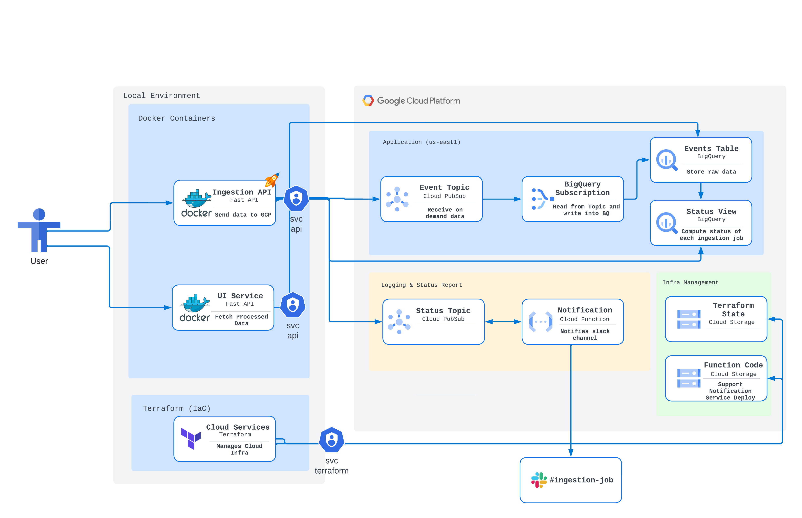
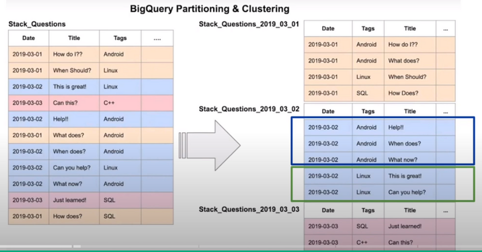

<!-- TOC start (generated with https://github.com/derlin/bitdowntoc) -->

* [Architecture Details](#architecture-details)
  * [Front-End](#front-end)
    * [Ingestion API](#ingestion-api)
    * [Web UI](#web-ui)
  * [Backend](#backend)
    * [Data Perspective](#data-perspective)
      * [Landing Data](#landing-data)
      * [Analytics](#analytics)
      * [Notification Service](#notification-service)
  * [Project Infrastructure](#project-infrastructure)

<!-- TOC end -->

<!-- TOC -->
# Architecture Details

This proposed solution adopts a hybrid approach, combining open-source containerized solutions with modern cloud-native applications to address the challenge requirements effectively. The architecture is designed to support on-demand, high-throughput data ingestion, ensuring efficient, scalable performance.

The high-level diagram below illustrates the design and interactions between components, showcasing how each part of the system collaborates to achieve seamless data ingestion and processing across the architecture.

<!-- TOC -->
## Front-End

<!-- TOC -->
### Ingestion API
This solution provides two core services, with the primary one being the **Ingestion API**. The **Ingestion API** supports on-demand data ingestion via HTTP POST requests and two different types of CSV file ingestion, making it versatile and adaptable to various data sources.

A custom API is especially useful when data preprocessing is required or when interacting directly with cloud APIs proves challenging.

Currently, the API is hosted in a Docker container but can easily be deployed to a Cloud VM or a managed container service. For scalability, a load balancer can be added to handle millions of requests seamlessly.

The **Ingestion API** endpoints can be called by a user or an external process to send data. Upon receiving a record or batch of records, the API assigns each an ingestion_id to track the success of the ingestion process.

The data is then published to the events_topic Pub/Sub topic, from which it will be streamed into BigQuery for near-real-time insertion. Similarly, ingestion status information is published to the status_topic Pub/Sub topic. This information flows through an event-driven architecture, triggering notifications in a user-specified Slack channel when the ingestion process completes.

This service uses the `svc-ingestion@jobsity-challenge-vitor.iam.gserviceaccount.com` service account with the following IAM permissions:

* **BigQuery Admin**
* **Pub/Sub Admin**

Ingestion API endpoints are documented here.

Code can be found under: `./local-services/ingestion-service` folder.

<!-- TOC -->
### Web UI

The second core service is the Web API, which, although minimal, serves a specific purpose. Currently, it has a single endpoint (with potential for more) that enables end-users to calculate the average number of trips within a specified square area. Upon invocation, this endpoint dynamically queries BigQuery to retrieve the requested data in real-time.

This service uses the `svc-ingestion@jobsity-challenge-vitor.iam.gserviceaccount.com` service account with the following IAM permissions:

* **BigQuery Admin**
* **Pub/Sub Admin**

Web UI endpoint is documented here.

Code can be found under: `./local-services/ui-service` folder.

<!-- TOC -->
## Backend

<!-- TOC -->
### Data Perspective

<!-- TOC -->
#### Landing Data
Google Cloud Pub/Sub serves as the initial landing point for raw data in this architecture, providing a highly efficient, scalable, and low-latency messaging system. Once data is processed by the Ingestion API, it is streamed into the events_topic Pub/Sub topic.

Data in the events_topic is available for almost instantaneous consumption, thanks to Pub/Sub’s high-throughput design. A BigQuery Subscription listens for new messages on the topic and promptly streams them into the designated BigQuery table, ensuring near real-time data availability for analytics. This seamless integration minimizes delays and maximizes data pipeline efficiency, making Pub/Sub ideal for handling high-frequency data ingestion.

As noted in the Google Pub/Sub documentation, Pub/Sub can handle writes at up to 4GB/s, while on the subscription side, BigQuery Subscriptions can read at a throughput of up to 400MB/s.

Given an average payload size of approximately 32KB:

* 32KB = 0.000032 GB
* This allows for roughly 125,000 records to be written per second (4GB).
* That translates to 7,500,000 records per minute.
* Ingesting 100 million records would therefore take about 80 minutes.

* 100 M records represents around 3.2TB (3200000 MB)
* 3200000 / 400MB/s = ~ 2 hours

To scale this architecture and reduce ingestion time, additional Pub/Sub topics could be created. By distributing writes across multiple topics, each with its own dedicated BigQuery Subscription consumer, the system can achieve even faster throughput and accommodate higher data volumes in less time.

<!-- TOC -->
#### Analytics
The BigQuery Subscription writes data directly into a raw BigQuery table, adhering to its predefined schema, making the data immediately accessible for analytics. This raw table is clustered by `origin_coord`, `destination_coord`, and `datetime` fields, ensuring that records with similar values in these fields are physically stored together. This clustering significantly improves query performance by enabling faster retrieval of related data. Partitioning can further optimize data retrieval by organizing records based on creation time—such as by day, month, or hour. This approach enhances data pruning efficiency, allowing queries to quickly isolate and retrieve relevant time-based data segments, significantly improving performance and reducing query costs.

.

A denormalized data model was chosen to align with BigQuery's distributed architecture, reducing the need for complex lookups. This design minimizes shuffle operations, allowing more processing time to be spent directly on data analysis.

Furthermore, BigQuery’s native support for geospatial data processing enhances efficiency when handling location-based queries, making it ideal for applications requiring geospatial insights.

<!-- TOC -->
#### Notification Service
The notification service ensures users are promptly informed once each ingestion job is completed. Every request made to the Ingestion API initiates a unique ingestion process.

Upon data submission to events_topic, the Ingestion API also sends metadata—such as ingestion_id and record count—to status_topic. When a status event arrives in Pub/Sub, it automatically triggers a Cloud Function designed to monitor the ingestion process. This function queries the ingestion_control view in BigQuery, which is derived from the raw table, counting the records associated with each ingestion_id. If the count matches the expected record count from status_topic, users are notified in the #ingestion-job Slack channel within the Jobsity workspace. If the current count is still less than anticipated, the Cloud Function re-enqueues the status message in Pub/Sub, ensuring the notification is only sent once all data has been fully ingested into BigQuery.

Code can be found under: `./notification-service` folder.

<!-- TOC -->
## Project Infrastructure
Terraform is a powerful Infrastructure-as-Code (IaC) tool that enables developers and operations teams to define, provision, and manage cloud resources in a highly efficient, repeatable, and scalable way. By allowing infrastructure to be treated as code, Terraform brings agility and precision to infrastructure management, transforming what used to be manual and time-consuming tasks into automated, auditable, and standardized processes.

In this project, every cloud resource involved—such as storage buckets, Pub/Sub topics, BigQuery tables, and Cloud Functions—is managed using Terraform. This IaC approach offers several critical benefits:

* **Consistency and Repeatability:** Terraform ensures that resources are provisioned consistently across multiple environments, minimizing configuration drift and human errors. Every infrastructure element is defined as code, which can be reused and adapted to deploy environments identically, whether for development, testing, or production.

* **Scalability and Flexibility:** Terraform’s modularity makes it easy to scale infrastructure up or down by simply updating configurations. The ability to parameterize resources enables rapid scaling and custom configuration changes without having to rebuild from scratch.

* **Collaboration and Version Control:** Using Terraform’s state management and a Cloud Storage backend, teams can collaborate on infrastructure seamlessly. This centralized state storage allows team members to share and review each other’s changes, ensuring everyone works with the latest version of the infrastructure configuration. Version control of the Terraform files also allows for safe rollbacks and a clear history of changes.

* **Multi-Cloud and Vendor-Agnostic Flexibility:** Terraform supports multiple cloud providers and on-premises environments through a single, unified language. This vendor-agnostic approach allows for hybrid and multi-cloud strategies, reducing dependency on any single provider and enabling resource portability.

* **Automation and CI/CD Integration:** By automating infrastructure provisioning, Terraform facilitates integration with CI/CD pipelines, enabling automated deployments and continuous delivery of infrastructure. This significantly speeds up the development and testing cycles, making it easier to adopt DevOps practices.

For this architecture, Terraform also simplifies the process of creating and managing dependencies between resources. By configuring a Cloud Storage bucket as the Terraform backend, state information is centrally stored, allowing easy collaboration among team members. This setup ensures that the infrastructure can be recreated or expanded easily by evaluators or other stakeholders, bringing transparency and simplicity to infrastructure management.

Overall, Terraform is crucial for modern cloud architectures, making it easier to deliver reliable, scalable, and consistent infrastructure that adapts effortlessly to evolving requirements.

This service uses the `svc-terraform-project@jobsity-challenge-vitor.iam.gserviceaccount.com` service account with the following IAM permissions:

* **BigQuery Admin**
* **Cloud Functions Admin**
* **Pub/Sub Admin**
* **Service Account User**
* **Storage Admin**
* **Storage Object Admin**

Code can be found under: `./infra-code` folder.
