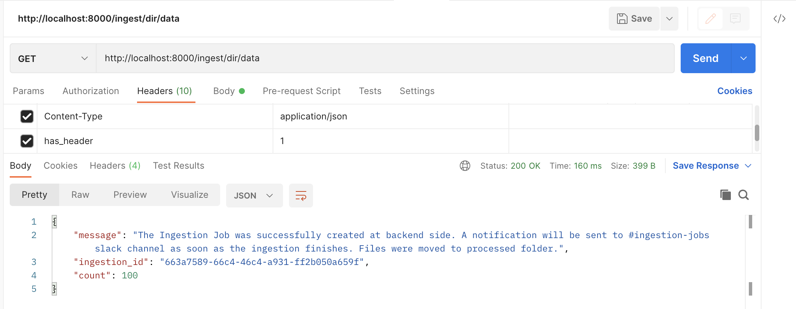
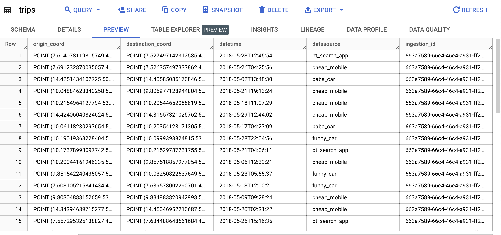
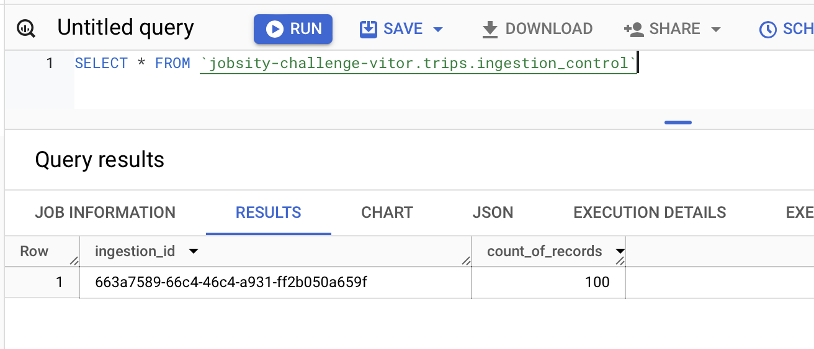
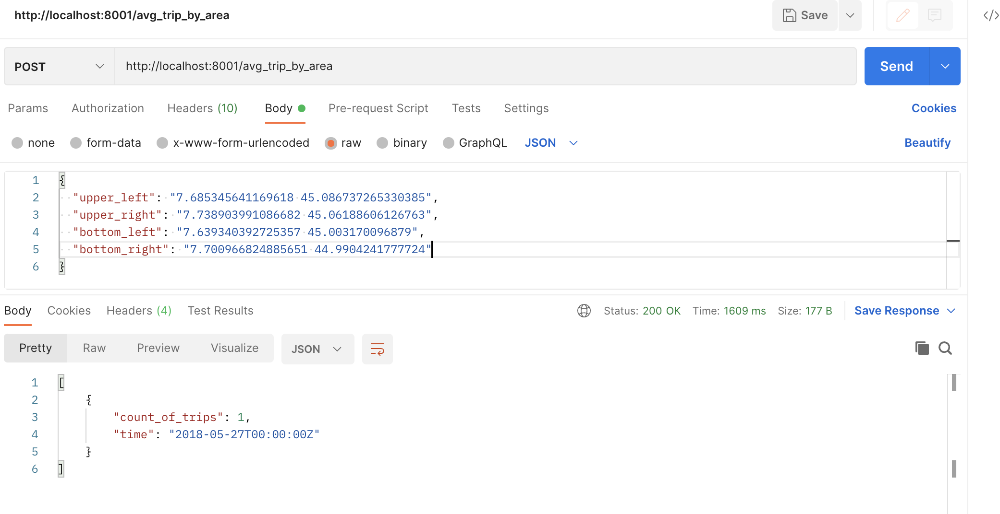

# Ingestion Service

The Ingestion API has mainly 3 endpoints:

* `/ingest` (POST): Receives an array of JSON objects from Request body and send them to PubSub.

```bash
curl -X 'POST' \
  'http://localhost:8000/ingest' \
  -H 'accept: application/json' \
  -H 'Content-Type: application/json' \
  -d '[
  {
    "region": "Prague",
    "origin_coord": "POINT (14.4973794438195 50.00136875782316)",
    "destination_coord": "POINT (14.43109483523328 50.04052930943246)",
    "datetime": "2018-05-28 09:03:40",
    "datasource": "funny_car"
  }
]'
```

* `/ingest/{dir}` (GET): Accepts a directory name located within the `./local-services/ingestion-service` folder, processes all the CSV files found in that directory, and subsequently moves them to the processed folder.

```bash
curl -X 'GET' \
  'http://localhost:8000/ingest/dir/data' \
  -H 'has_header: 1'
```

**NOTE:** If the CSV file has header than the `has_header` must be set as `1` into Request Header, otherwise the file header will wrongly be considered as a valid record.

* `/ingest/{dir}/file/{file_name}` (GET): Accepts a directory name and a file name located within the `./local-services/ingestion-service/{dir}` folder and processes the CSV file found in that directory, and subsequently moves it to the processed folder.

```bash
curl -X 'GET' \
  'http://localhost:8000/ingest/dir/data/file_name/teste.csv' \
  -H 'has_header: 1'
```

You can also check out the generated Fast API documentation at `http://localhost:8000/docs#/`

# UI Service

The Ingestion API has only 1 endpoint:

* `/avg_trip_by_area` (POST): Accepts a dict containing the following structure:

`longitude latitude`

```bash
curl -X 'POST' \
  'http://localhost:8001/avg_trip_by_area' \
  -H 'accept: application/json' \
  -H 'Content-Type: application/json' \
  -d '[
    {
    "upper_left": "7.685345641169618 45.086737265330385",
    "upper_right": "7.738903991086682 45.06188606126763",
    "bottom_left": "7.639340392725357 45.003170096879",
    "bottom_right": "7.700966824885651 44.9904241777724"
    }
    ]'
```


# Proof of working








