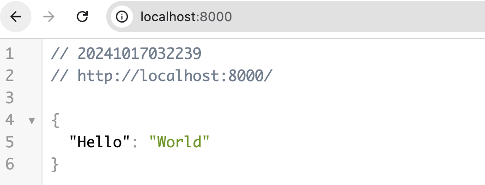

<!-- TOC start (generated with https://github.com/derlin/bitdowntoc) -->

* [Setup Guide](#setup-guide)
  * [Prerequisites](#prerequisites)
  * [Creating Cloud Infrastructure](#creating-cloud-infrastructure)
  * [Starting Docker Containers](#starting-docker-containers)
  * [Interacting with Services](#interacting-with-services)

<!-- TOC end -->


<!-- TOC --><a name="setup-guide"></a>
# Setup Guide

<!-- TOC --><a name="prerequisites"></a>
## Prerequisites
To set up and run this project, a few initial steps are required:

* **Access to GCP Project and Slack Channel**
Please request access from Vitor Henrique Mendes to be added as an evaluator in the GCP project and in the #ingestion-job Slack channel, where notifications are sent upon completion of ingestion jobs.

* **Ensure Slack Webhook is not expired**: Regrettably, the Slack webhook utilized to send messages to the Jobsity workspace expires 12 hours after its creation. Depending on when the evaluator reviews the challenge, it may be necessary to recreate the webhook and update the slack_webhook variable in `./infra-code/terraform.tfvars`, followed by redeploying the infrastructure.

* **Generate and Configure GCP Service Account Key**
Once access is granted, complete the following steps within the GCP project:

Generate a new key for the `svc-ingestion@jobsity-challenge-vitor.iam.gserviceaccount.com` service account.
Place the key file in the `./local-services/ingestion-service` and `./local-services/ui-service` directories, naming it `gcp_credentials.json`.

The same process **must** be done for Terraform project. Generate a new key for the `svc-terraform-project@jobsity-challenge-vitor.iam.gserviceaccount.com` service account and place it in the `./infra-code` folder, naming it `credentials.json`.

* **Configure GOOGLE_APPLICATION_CREDENTIALS env var**: export `GOOGLE_APPLICATION_CREDENTIALS` environment variable. This shoud point to `./infra-code/credentials.json`

```bash
cd ./infra-code
export GOOGLE_APPLICATION_CREDENTIALS=$(pwd)/credentials.json
```

```
.
├── docs
├── infra-code/
│   ├── ...
│   └── credentials.json (from svc-terraform-project)
├── local-services/
│   ├── ingestion-service/
│   │   ├── ...
│   │   └── gcp_credentials.json (from svc-ingestion)
│   └── ui-service/
│       ├── ...
│       └── gcp_credentials.json (from svc-ingestion)
└── notification-service
```

With these steps, you’ll be set up to interact with the project infrastructure effectively.

<!-- TOC --><a name="creating-cloud-infrastructure"></a>
## Creating Cloud Infrastructure

After cloning the project, navigate to the ./infra-code directory in your terminal. Ensure you have Terraform version 1.7.5 or later installed. Begin by initializing the Terraform environment with the following command:

```bash
terraform init
```

This command will instruct Terraform to download the necessary providers and establish a connection to its remote state stored in the Google Cloud Storage (GCS) bucket.

Once the initialization is complete, proceed to create the required infrastructure resources by executing:

```bash
terraform apply -auto-approve
```

The -auto-approve flag allows Terraform to apply the changes without prompting for confirmation, streamlining the deployment process.

<!-- TOC --><a name="starting-docker-containers"></a>
## Starting Docker Containers

To initiate the **Ingestion API** and **Web UI** services, navigate to the `./local-services` directory and execute the following command:

```bash
docker compose up -d
```

This command will launch both services in detached mode, allowing them to run in the background. The Ingestion API will be accessible at port `8000`, while the Web UI will be available at port `8001`.

To verify that both services are up and running, you can perform a GET HTTP request by visiting the following URLs in your web browser or using a tool like curl:

* **For the Ingestion API:** `http://localhost:8000`
* **For the Web UI:** `http://localhost:8001`

This ensures that the services are functioning correctly and ready to handle requests.



<!-- TOC --><a name="interacting-with-services"></a>
## Interacting with Services

With the services now up and running and the infrastructure successfully set up, it's time to start ingesting data and performing geospatial analytics! Let's go to the `interacting doc page`. 😊
